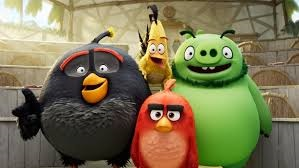

Angry Bird
=====

## Purpose
The purpose is to make famous world game - "Angry Bird" in unity.

## Description
This project is for mobile device.              

    
  

There are several types of birds and each bird has special ability.
And if user’s shoot bird, it will fly to pigs and explode.
But while bird is flying, if users touch the phone, each bird will show its special ability.
For instance, yellow bird will show high speed and more attack damage.
And white bird will drop an egg and it will explode.
If users destroy all pigs, they can see success dialog but if they don’t destroy all pigs while they are using all birds, they will see fail dialog.

## Technical specifications

This project has the following technical specifications.

-UI part
*	Menu window using NGUI package.
* Success and Fail dialog using animation.

-Main game part
*	Bird attack using physical force.
* Explosion effect using particle of Unity. 
* Display birds’ track using Trail Render.

